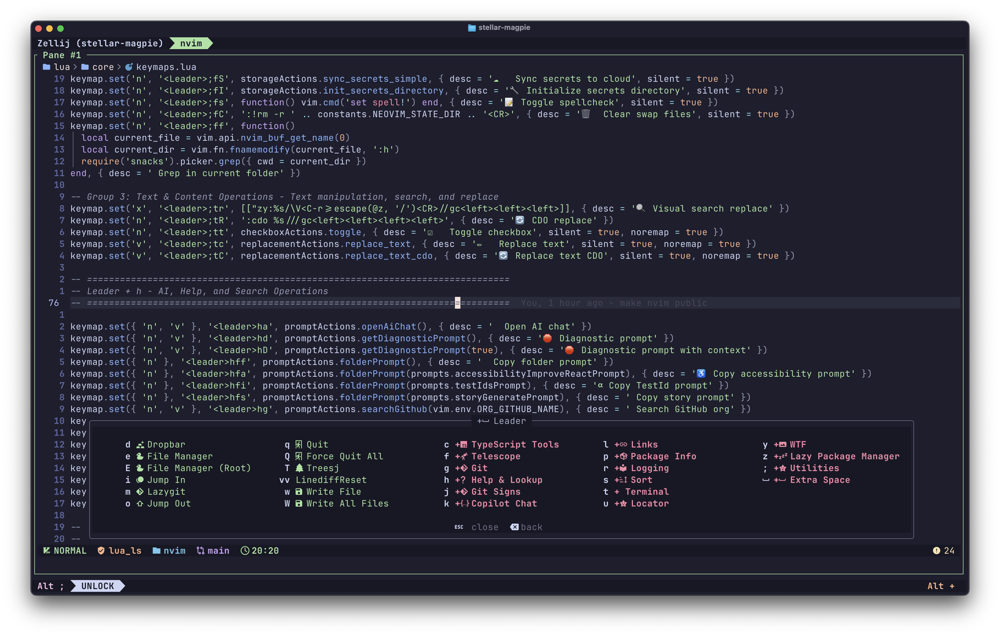

# Jimmy's Neovim Configuration

**A hand-crafted, blazing-fast Neovim IDE that loads 45+ plugins in under 25ms.**

[](https://neovim.io)
[](https://www.lua.org)
[](LICENSE)
[](https://github.com/JimmyTranDev/nvim-config/commits)



<!-- TODO: Add animated GIF demo showcasing key workflows (Todoist, fuzzy finding, AI assist) -->
<!--  -->

Every plugin earned its place. Every keybinding has a reason. This is a Neovim configuration built for real-world, full-stack development — with custom integrations you won't find anywhere else.

---

## Why This Config

Most Neovim configs fall into two camps: minimal setups that leave you missing IDE features, or bloated distributions that take seconds to start and fight you at every turn.

This config rejects that trade-off. It loads **45+ plugins in ~25ms** through aggressive lazy loading, so you get the full power of LSP, AI completion, Git workflows, and fuzzy finding without ever waiting for your editor. It stays fast because every plugin is loaded on demand — zero blocking at startup.

But speed is just the baseline. What makes this config different is what it connects to. Todoist tasks, Jira tickets, GitHub repositories, and a personal journal system are all accessible without leaving the editor. These aren't wrappers around CLI tools — they're purpose-built Lua modules talking directly to APIs, designed around how a working developer actually moves through their day.

---

## Feature Highlights

### Intelligent Code Completion

Rust-powered completion engine (Blink.cmp) paired with GitHub Copilot for instant, context-aware suggestions. AI chat through CopilotChat for code review, debugging, and refactoring — all inline.

### Full Language Server Protocol

20+ language servers auto-installed and managed through Mason. TypeScript, Java, Python, Go, Rust, Lua, and more — each with formatting, diagnostics, and code actions configured out of the box.

### Advanced Navigation

Snacks.picker for modern fuzzy finding. Yazi as a full terminal file manager. Hop and Leap for instant cursor movement. Arrow for persistent file bookmarks. 175+ keybindings organized by logical groups.

### Complete Git Workflow

LazyGit for visual staging and commits. Toggleterm-backed keymaps for Git commands. GitSigns for inline blame and diff indicators. Custom branch creation with automatic Jira ticket linking.

### AI-Powered Development

CopilotChat for explain, review, fix, and optimize workflows. WTF.nvim for AI-driven diagnostic debugging.

### Polished UI

Catppuccin color scheme. Custom bubble-style statusline. Contextual breadcrumbs via Dropbar. Dashboard, floating terminals, and notification system through Snacks.nvim.

<details>
<summary><strong>Full plugin list by category</strong></summary>

**Core Development**
| Plugin | Description |
|--------|-------------|
| Blink.cmp | Rust-based, ultra-fast autocompletion |
| Mason + nvim-lspconfig | 20+ language servers with auto-installation |
| Treesitter + textobjects | Advanced parsing and smart text objects |
| Snacks.picker | Modern fuzzy finder |
| Yazi | Terminal file manager |
| LazyGit + GitSigns | Complete Git workflow |

**AI and Productivity**
| Plugin | Description |
|--------|-------------|
| GitHub Copilot | Inline AI code completion |
| CopilotChat.nvim | AI chat with review, explain, fix, optimize |
| WTF.nvim | AI-powered diagnostic debugging |
| LeetCode.nvim | Full LeetCode workflow with testing |
| Typr | Typing speed practice |

**Navigation and Editing**
| Plugin | Description |
|--------|-------------|
| Hop + Leap | Quick cursor movement and jumping |
| Arrow | File bookmarks for quick access |
| nvim-surround | Intelligent text surrounding |
| TreeSJ | Smart split/join code blocks |
| substitute.nvim | Advanced find and replace |
| mini.ai | Enhanced text objects |

**Visual and UI**
| Plugin | Description |
|--------|-------------|
| Catppuccin | Color scheme |
| Snacks.nvim | Dashboard, notifications, terminals |
| Dropbar | Contextual breadcrumbs |
| Lualine | Custom bubble-style statusline |
| wilder.nvim | Enhanced command-line completion |
| nerdy.nvim | Nerd Font icon picker |

**Language Support**
| Language | Features |
|----------|----------|
| TypeScript/JavaScript | typescript-tools, ESLint, import organization |
| Java | nvim-java with Maven/Gradle, Android emulator |
| Lua | Full Neovim API completion |
| HTML/CSS | ts-autotag, Tailwind support |
| Python, Go, Rust | LSP + formatters + debuggers |

</details>

---

## Standout Integrations

These aren't plugins — they're custom Lua modules built from scratch, talking directly to external APIs.

**Todoist** -- Full API integration for task management. Browse projects, filter by priority, create and complete tasks, all from a floating picker inside Neovim.

**Jira** -- Create tickets and link branches to issues without opening a browser. Branch names auto-format with Jira ticket codes for traceability.

**GitHub** -- Repository management, organization switching, and PR workflows. Clone, browse, and manage repos across multiple GitHub orgs from the command line.

**Journal** -- A personal journaling system with timestamped entries. Quick-capture thoughts, meeting notes, and daily logs without leaving your editor.

<details>
<summary><strong>All custom modules</strong></summary>

**Actions (14 modules)**
- todoist.lua -- Todoist API integration with project filtering and priorities
- jira.lua -- Jira task creation with ticket linking
- journal.lua -- Personal journaling system
- git.lua -- Git workflows with Jira branch naming
- github.lua -- GitHub organization and repository management
- language.lua -- Multi-language tools (Java, TypeScript, ESLint, Knip)
- files.lua -- Advanced file operations and clipboard integration
- links.lua -- Environment-aware URL handling
- errors.lua -- Diagnostic copying and analysis
- checkbox.lua -- Markdown checkbox toggling
- replacement.lua -- Buffer and project-wide search/replace
- documentation.lua -- README convention management
- editor.lua -- Spellcheck, wrap toggle, editor utilities
- buffers.lua -- Buffer management operations

**Utilities (14+ modules)**
- http.lua -- Async HTTP client with GET/POST/PATCH
- todoist.lua -- Todoist API client
- github.lua -- GitHub integration helpers
- git.lua -- Git operations and branch utilities
- files.lua -- File system operations
- input.lua -- User input handling
- json.lua -- JSON parsing with error recovery
- async.lua -- Non-blocking command execution
- url.lua -- URL manipulation
- string.lua -- String utilities
- array.lua -- Array helpers
- validation.lua -- Input validation
- ui.lua -- UI utilities
- errors.lua -- Error handling
- language.lua -- Language detection utilities
- links.lua -- Link generation helpers

</details>

---

## Architecture

This config follows a strict modular architecture: core settings are isolated from plugin configurations, and custom productivity features live in their own namespace. Nothing is tangled together — every module can be understood, modified, or removed independently.

<details>
<summary><strong>Full directory tree</strong></summary>

```
nvim/
├── init.lua                    # Entry point
├── lazy-lock.json              # Plugin version lockfile
└── lua/
    ├── core/                   # Essential configuration
    │   ├── lazy.lua            # Plugin manager bootstrap
    │   ├── options.lua         # Neovim settings
    │   ├── plugins.lua         # Plugin loader
    │   ├── commands.lua        # Autocommands & automation
    │   ├── keymaps.lua         # 175+ organized keybindings
    │   ├── statusline.lua      # Custom Lualine design
    │   └── constants.lua       # Global constants & colors
    │
    ├── plugins/                # 45+ plugin configurations
    │   ├── blink.lua           # Completion engine
    │   ├── snacks.lua          # Modern utility suite
    │   ├── copilot.lua         # GitHub Copilot
    │   ├── copilot-chat.lua    # Copilot Chat
    │   ├── leetcode.lua        # LeetCode integration
    │   ├── treesitter.lua      # Syntax highlighting
    │   ├── mason-lspconfig.lua # LSP management
    │   ├── lazygit.lua         # Git TUI
    │   ├── git.lua             # Git keymaps
    │   ├── yazi.lua            # File manager
    │   └── ...
    │
    └── custom/                 # Unique productivity features
        ├── actions/            # 14 automation modules
        ├── utils/              # 14+ utility libraries
        └── constants/          # Configuration constants
```

</details>

---

## Performance

| Metric | Value |
|--------|-------|
| **Startup time** | ~25ms with 45+ plugins |
| **Memory baseline** | ~18MB |
| **Blocking at startup** | 0ms -- everything lazy loaded |
| **LSP completion** | Sub-100ms response time |

---

## License

[Apache 2.0](LICENSE)

Built by [Jimmy Tran](https://github.com/JimmyTranDev)
